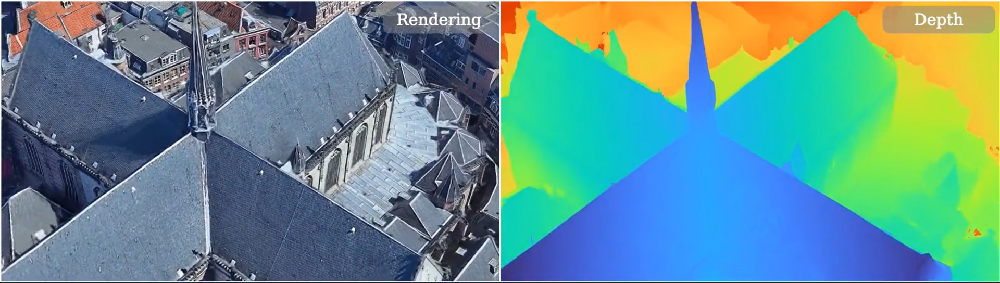
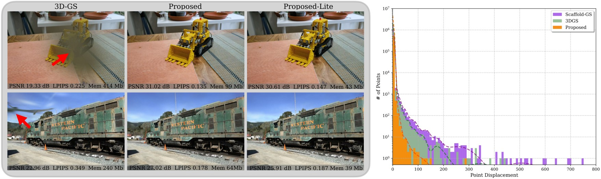
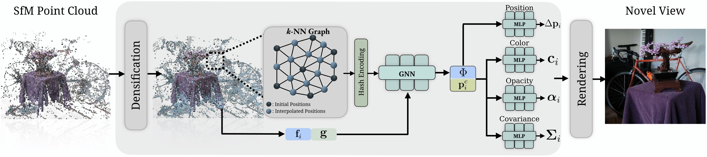

<div align="center">

# SAGS: Structure-Aware 3D Gaussian Splatting

[Evangelos Ververas](https://scholar.google.com/citations?user=KkAjki8AAAAJ&hl=en)<sup>1,2*</sup> &emsp; [Rolandos Alexandros Potamias](https://rolpotamias.github.io)<sup>1,2*</sup> &emsp; [Jifei Song](https://scholar.google.com/citations?user=9a1PjCIAAAAJ)<sup>2</sup> &emsp; [Jiankang Deng](https://jiankangdeng.github.io/)<sup>1,2</sup> &emsp; [Stefanos Zafeiriou](https://www.imperial.ac.uk/people/s.zafeiriou)<sup>1</sup>  

<sup>1</sup>Imperial College London, UK <br>
<sup>2</sup>Huawei Noah’s Ark Lab, UK <br>
<sup>*</sup>Equal Contribution

<strong>ECCV 2024</strong>

<a href='https://eververas.github.io/SAGS/'></a>
<a href='https://arxiv.org/abs/2404.19149'></a>
</div>


This is the official implementation of **[SAGS: Structure-Aware Gaussian Splatting](https://eververas.github.io/SAGS/)**, a state-of-the-art Gaussian Splatting scene reconstruction method. 
SAGS implicitly encodes the geometry of the scene based on a local-global graph representation that facilitates the learning of complex deatails and enforces meaningful point displacements that preserve the scene's geometry.
SAGS achieves state-of-the-art rendering performance and reduced storage requirements on benchmark novel-view synthesis datasets, while effectively mitigating floating artifacts and irregular distortions of previous methods and obtaining precise depth maps.


<!--  -->



## Installation

The project has been tested on a server configured with Ubuntu 22.04, cuda 12.4 and gcc 11.4.0. Similar configurations should also work, but have not been verified.

1. Clone this repo:

```
git clone https://github.com/eververas/SAGS.git --recursive
cd SAGS
```

2. Install dependencies

```
conda create -n sags python=3.9
conda activate sags

pip install torch==2.6.0 torchvision==0.21.0 torchaudio==2.6.0 --index-url https://download.pytorch.org/whl/cu124
pip install -r requirements.txt
```


## Data

Download the scenes from the sources listed below and uncompress them into a ```data/``` folder created in the project root path.

- The Tanks&Temples and Deep Blending datasets can be downloaded from 3D-Gaussian-Splatting project [here](https://repo-sam.inria.fr/fungraph/3d-gaussian-splatting/datasets/input/tandt_db.zip). 
- The MipNeRF360 scenes can be downloaded the paper author's website [here](https://jonbarron.info/mipnerf360/).
- The BungeeNeRF dataset is available in [Google Drive](https://drive.google.com/file/d/1nBLcf9Jrr6sdxKa1Hbd47IArQQ_X8lww/view?usp=sharing)/[百度网盘[提取码:4whv]](https://pan.baidu.com/s/1AUYUJojhhICSKO2JrmOnCA).

The data structure will be organised as follows:

```
data/
├── dataset_name
│   ├── scene1/
│   │   ├── images
│   │   │   ├── IMG_0.jpg
│   │   │   ├── IMG_1.jpg
│   │   │   ├── ...
│   │   ├── sparse/
│   │       └──0/
│   ├── scene2/
│   │   ├── images
│   │   │   ├── IMG_0.jpg
│   │   │   ├── IMG_1.jpg
│   │   │   ├── ...
│   │   ├── sparse/
│   │       └──0/
...
```


## Training

For training a single scene, run:
```
bash ./single_train.sh scene exp_name
```

- scene: scene name. The available scene names can be seen by running ```bash ./single_train.sh```
- exp_name: user-defined experiment name

The above script will store the log in ```outputs/dataset_name/scene_name/exp_name_cur_date_time```.

For example, to train a model on the scene ```train``` with experiment name ```baseline```, run the following:
```
bash ./single_train.sh train baseline
```
This will produce an output in ```outputs/tandt_db/tandt/train/baseline_cur_date_time```.


## Evaluation

The render test views and calculate metrics using the trained models, run: 

```
bash ./single_test.sh scene exp_name
```

- scene: scene name. The available scene names can be seen by running ```bash ./single_test.sh```
- exp_name: user-defined experiment name as defined in ```outputs/dataset_name/scene_name/exp_name```


## Citation

If you find our work helpful, please consider citing:

```bibtex
@inproceedings{ververas2024sags,
  title={SAGS: Structure-Aware 3D Gaussian splatting},
  author={Ververas, Evangelos and Potamias, Rolandos Alexandros and Song, Jifei and Deng, Jiankang and Zafeiriou, Stefanos},
  booktitle={European Conference on Computer Vision},
  pages={221--238},
  year={2024},
  organization={Springer}
}
```

## LICENSE

Please follow the LICENSE of [3D-GS](https://github.com/graphdeco-inria/gaussian-splatting).

## Acknowledgement

We thank the authors of [3D-GS](https://github.com/graphdeco-inria/gaussian-splatting) and [Scaffold-GS](https://github.com/city-super/Scaffold-GS) for their excellent work.
  
